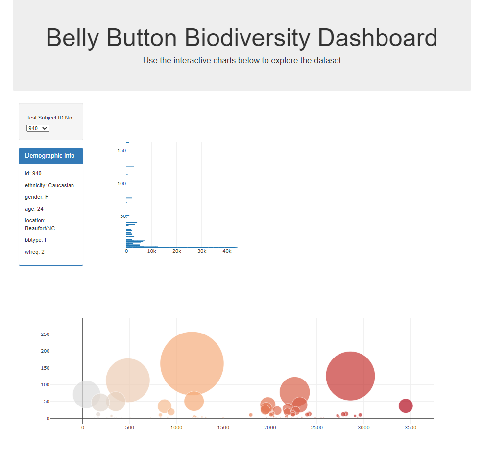

# Plot.ly Homework - Belly Button Biodiversity

In this assignment, you will build an interactive dashboard to explore the [Belly Button Biodiversity dataset](http://robdunnlab.com/projects/belly-button-biodiversity/), which catalogs the microbes that colonize human navels.

The dataset reveals that a small handful of microbial species (also called operational taxonomic units, or OTUs, in the study) were present in more than 70% of people, while the rest were relatively rare.

Dataset used for this analysis can be found here: 
https://github.com/nicky-plat/Belly-Button-Biodiversity/blob/main/data/samples.json

### View my dashboard using the link below:

https://nicky-plat.github.io/Belly-Button-Biodiversity/

